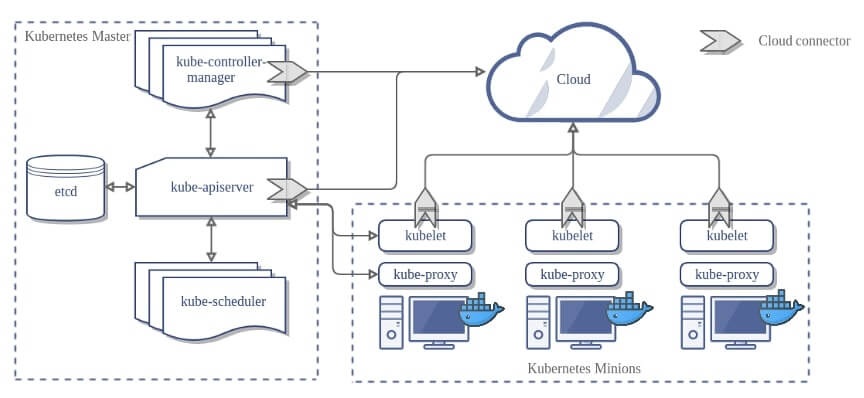

# KUBERNETS / K8S
https://devopssec.fr/article/creer-cluster-kubernetes-multi-noeud-vagrant-ansible

Arrive alors en 2014 Kubernetes souvent abrégé k8s, né à partir du projet Borg et Omega. Ces deux derniers ont été développés en tant que systèmes purement internes à Google, à l'inverse de Kubernetes, qui est quant à lui maintenant devenu une version opensource de ses prédécesseurs avec des fonctionnalités améliorées permettant de résoudre les anciens problèmes de gestion des clusters, ainsi qu'un support accru de la part d'IBM, Cisco et Redhat.
De nos jours le projet n'appartient plus vraiment à Google, car Google a fait don du projet Kubernetes en 2015 à la toute récente Cloud Native Computing Foundation.

### Les objets Kubernetes
- **Node** : un node est une machine de travail du cluster Kubernetes. Ce sont des unités de travail qui peuvent être physiques, virtuelles mais aussi des instances cloud.
- **Pod** : Il s'agit de l'unité la plus petite de K8s, un pod encapsule le ou les conteneur(s) formant votre application conteneurisée partageant ainsi la même stack réseau (chaque pod se voit attribuer une adresse IP unique) et le même stockage, plus précisément un volume partagé (tous les conteneurs du pod peuvent accéder aux volumes partagés, ce qui permet à ces conteneurs de partager plus facilement des données).
- **Replicas** : c'est le nombre d'instances d'un Pod
- **ReplicaSet** :  s'assure que les réplicas spécifiés sont actifs
- **Deployment** : défini l'état désiré et fournit des mises à jour déclaratives de vos Pods et ReplicaSets.
- **Service** : Un service peut être défini comme un ensemble logique de pods exposés en tant que service réseau. C'est un niveau d'abstraction au-dessus du pod, qui fournit une adresse IP et un nom DNS unique pour un ensemble de pods. Avec les Services, il est très facile de gérer la configuration de Load Balancing (équilibreur de charge) permettant ainsi aux pods de scaler plus facilement.
- **Endpoint** : Représente l'adresse IP et le port d'un service, il est automatiquement créé lors de la création d'un service avec les pods correspondants.

### Les composants des nodes
Kubernetes suit l’architecture maître-esclave, le maître plus communément appelé master existe principalement pour gérer votre cluster Kubernetes. . Les esclaves sont quant à eux plus connus sous le nom de workers (on les appellent aussi minions ) et ne sont là que pour fournir de la capacité et n'ont pas le pouvoir d'ordonner à une autre node ce qu'il peut ou ne peut pas faire. 

#### Les composants du Master
- **kube-apiserver** : point d'entrée exposant l'API HTTP Rest de k8s depuis le maître du cluster Kubernetes. Différents outils et bibliothèques peuvent facilement communiquer avec l'API.
- **kube-scheduler** : Il est responsable de la répartition et l'utilisation de la charge de travail sur les nœuds du cluster selon les ressources nécessaires et celles disponibles.
- **kube-controller-manager** : ce composant est responsable de la plupart des collecteurs qui récupèrent des informations du cluster tout en effectuant des actions de correctives en cas de besoin, en apportant des modifications pour amener l'état actuel du serveur à l'état souhaité. Il est composé de plusieurs contrôleurs, on peut par exemple retrouver un contrôleur de réplication qui va s'assurer que vous avez le nombre désiré de répliques sur vos pods, mais aussi d'autres contrôleurs clés comme , le contrôleur de Endpoints, le contrôleur d’espace de noms et le contrôleur de compte de service.
- **cloud-controller-manager** :effectue les mêmes actions que le **kube-controller-manager** mais pour des fournisseurs de cloud sous-jacents (AWS, Azure, Google Cloud Platform, etc ...).
- **etcd** : il stocke les informations de configuration pouvant être utilisées par chacun des nœuds du cluster. Ces informations sont conservées sous forme de clé et valeurs à haute disponibilité

#### Les composants des Workers
- **kubelet** : Il s’agit d’un agent qui s'exécute dans chaque nœud chargé de relayer les informations au Master. Il interagit avec la base de données **etcd** du Master pour récupérer des informations afin de connaître les tâches à effectuer. Il assume la responsabilité de maintenir en bon état de fonctionnement les conteneurs d'un pod et s'assure qu'ils tournent conformément à la spécification. Il ne gère pas les conteneurs qui n'ont pas été créés par Kubernetes. Il communique avec le Master et redémarre le conteneur défaillant en cas de crash.
- **kube-proxy** : il active l'abstraction réseau du Service Kubernetes en maintenant les règles du réseau et permet l'exposition des services vers l'extérieur.
- **Environnement d'exécution de conteneurs** : Il faut vous aussi une solution d'exécution d'applications conteneurisées, vous pouvez utiliser soit le moteur Docker mais Kubernetes prend également en charge l'utilisation de rkt comme moteur d'exécution du conteneur.



### Installation
#### Désactiver l'espace Swap
```bash
sudo swapoff -a
sudo sed -i '/ swap / s/^\(.*\)$/#\1/g' /etc/fstab
```
#### Ajouter des modules Kernel
```bash
sudo tee /etc/modules-load.d/containerd.conf <<EOF
overlay
br_netfilter
EOF

sudo modprobe overlay
sudo modprobe br_netfilter
```
Editer les paramètres kernel :
```bash
sudo vim /etc/sysctl.d/k8s.conf
```
```
net.bridge.bridge-nf-call-iptables  = 1
net.ipv4.ip_forward                 = 1
net.bridge.bridge-nf-call-ip6tables = 1
```
```bash
sudo sysctl --system
```
#### Installer Containerd
```bash
sudo dnf config-manager --add-repo https://download.docker.com/linux/centos/docker-ce.repo
sudo dnf install containerd.io -y
containerd config default | sudo tee /etc/containerd/config.toml >/dev/null 2>&1
sudo sed -i 's/SystemdCgroup \= false/SystemdCgroup \= true/g' /etc/containerd/config.toml
sudo systemctl restart containerd
sudo systemctl enable containerd
```
#### Installer Kubernetes
```bash
sudo cat <<EOF | sudo tee /etc/yum.repos.d/kubernetes.repo
[kubernetes]
name=Kubernetes
baseurl=https://pkgs.k8s.io/core:/stable:/v1.28/rpm/
enabled=1
gpgcheck=1
gpgkey=https://pkgs.k8s.io/core:/stable:/v1.28/rpm/repodata/repomd.xml.key
exclude=kubelet kubeadm kubectl cri-tools kubernetes-cni
EOF
```
```bash
sudo yum install -y kubelet kubeadm kubectl --disableexcludes=kubernetes
sudo systemctl enable --now kubelet
```
#### Ouvrir les ports du Firewall
Sur les **Masters**:
```bash
sudo firewall-cmd --permanent --add-port={6443,2379,2380,10250,10251,10252,10257,10259,179}/tcp
sudo firewall-cmd --permanent --add-port=4789/udp
sudo firewall-cmd --reload
```
Sur les **Workers**:
```bash
sudo firewall-cmd --permanent --add-port={179,10250,30000-32767}/tcp
sudo firewall-cmd --permanent --add-port=4789/udp
sudo firewall-cmd --reload
```

#### Configuration d'un cluster K8S
**Master**:
```bash
sudo kubeadm init --control-plane-endpoint=k8s-master-01
```
Resultat :
```
Your Kubernetes control-plane has initialized successfully!

To start using your cluster, you need to run the following as a regular user:

  mkdir -p $HOME/.kube
  sudo cp -i /etc/kubernetes/admin.conf $HOME/.kube/config
  sudo chown $(id -u):$(id -g) $HOME/.kube/config

Alternatively, if you are the root user, you can run:

  export KUBECONFIG=/etc/kubernetes/admin.conf

You should now deploy a pod network to the cluster.
Run "kubectl apply -f [podnetwork].yaml" with one of the options listed at:
  https://kubernetes.io/docs/concepts/cluster-administration/addons/

You can now join any number of control-plane nodes by copying certificate authorities
and service account keys on each node and then running the following as root:

  kubeadm join k8s-master-01:6443 --token 9j5eqt.eypgpo2hjz8no2xp \
        --discovery-token-ca-cert-hash sha256:871803dd4cbc27cd7cce212cd467636b84ed2795501c5aa47a572a040cdaaee0 \
        --control-plane

Then you can join any number of worker nodes by running the following on each as root:

kubeadm join k8s-master-01:6443 --token 9j5eqt.eypgpo2hjz8no2xp \
        --discovery-token-ca-cert-hash sha256:871803dd4cbc27cd7cce212cd467636b84ed2795501c5aa47a572a040cdaaee0
```
```bash
mkdir -p $HOME/.kube
sudo cp -i /etc/kubernetes/admin.conf $HOME/.kube/config
sudo chown $(id -u):$(id -g) $HOME/.kube/config
```
**Worker**:
Récupérer la commande dans la sortie de la commande exécuter sur le Master.
```bash
kubeadm join k8s-master-01:6443 --token 9j5eqt.eypgpo2hjz8no2xp \
    --discovery-token-ca-cert-hash sha256:871803dd4cbc27cd7cce212cd467636b84ed2795501c5aa47a572a040cdaaee0
```
#### Installer Calico
Sur le **Master**:
```bash
kubectl apply -f https://raw.githubusercontent.com/projectcalico/calico/v3.26.1/manifests/calico.yaml
kubectl get pods -n kube-system
```
Attendre que tous les pods soit en "Running"
#### Premier déploiement 
```bash
kubectl create deployment web-app01 --image nginx --replicas 2
kubectl expose deployment web-app01 --type NodePort --port 80
kubectl get deployment web-app01
kubectl get pods -o wide
kubectl get svc web-app01
```


